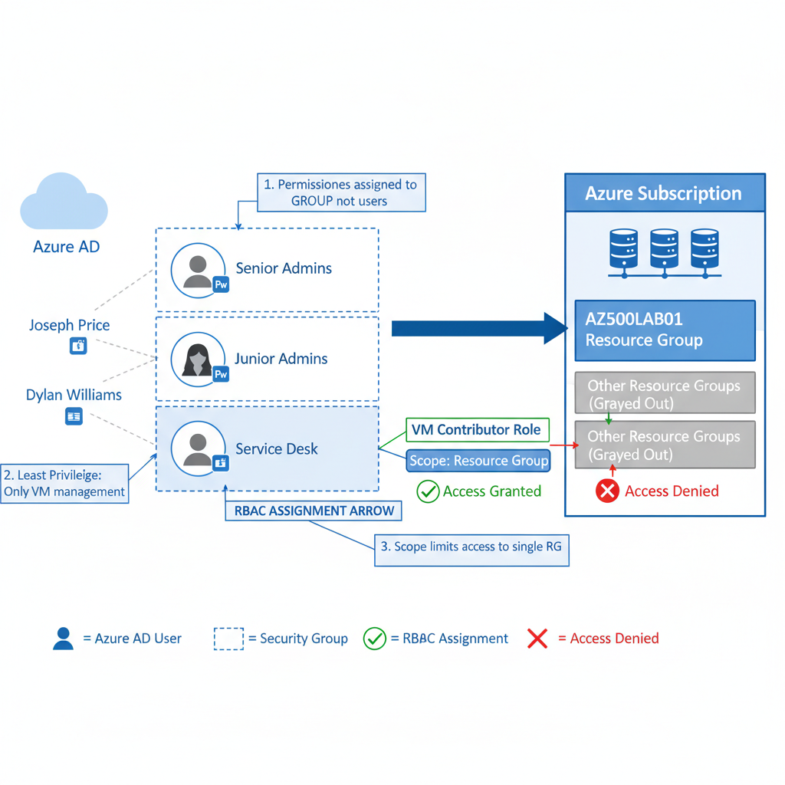

# Lab 01: Role-Based Access Control (RBAC)

## Objective
Implement the least privilege principle by assigning permissions to security groups rather than individual users, enabling easier auditing and access management.

## Architecture



**Components:**
- Azure AD Users: Joseph Price, Isabel Garcia, Dylan Williams
- Security Groups: Senior Admins, Junior Admins, Service Desk
- Resource Group: AZ500LAB01
- Role Assignment: Virtual Machine Contributor → Service Desk group
- Scope: Resource Group level only

## Implementation

### User Creation (Multi-Interface Practice)
| User | Tool | Purpose |
|------|------|---------|
| Joseph Price | Azure Portal | GUI-based management |
| Isabel Garcia | PowerShell | Scripting and automation |
| Dylan Williams | Azure CLI (Bash) | Cross-platform DevOps |

### RBAC Configuration
- **Role**: Virtual Machine Contributor
- **Assignee**: Service Desk security group (contains Dylan Williams)
- **Scope**: AZ500LAB01 Resource Group
- **Effect**: Members can manage VMs within this RG only

## Key Learnings

**Why Groups Over Users:**
- Centralized permission management
- Easy auditing (check group membership vs individual assignments)
- Scalable (add/remove users without touching role assignments)
- Follows enterprise best practices

**Scope Limitation:**
- Dylan has VM Contributor rights ONLY in AZ500LAB01
- No access to other Resource Groups
- Prevents lateral movement and privilege escalation

**Multi-Tool Proficiency:**
Essential for automation and different operational contexts:
- Portal: Quick one-off tasks
- PowerShell: Windows automation, bulk operations
- Azure CLI: Cross-platform, CI/CD pipelines

## Validation Results

✅ Dylan Williams can manage VMs in AZ500LAB01 Resource Group  
✅ Dylan has NO permissions outside this scope  
✅ Permissions inherited through Service Desk group membership  
✅ Audit trail shows group-based assignment (clean IAM)

## Security Principles Demonstrated

- **Least Privilege**: Minimum permissions needed for job function
- **Separation of Duties**: Different groups for different roles
- **Group-Based Access**: Never assign permissions directly to users
- **Scope Limitation**: Restrict access to specific resource boundaries

## Skills Demonstrated

`Azure RBAC` `Identity and Access Management` `PowerShell` `Azure CLI` `Security Groups` `Least Privilege` `Access Control`

---

*Completed as part of AZ-500 certification preparation*
```

---

### 🎨 Prompt pour Nanobana (diagramme)
```
Create an Azure RBAC architecture diagram showing:

1. Azure AD tenant containing:
   - Three user icons labeled:
     * Joseph Price (created via Portal - show portal icon)
     * Isabel Garcia (created via PowerShell - show PS icon)
     * Dylan Williams (created via Azure CLI - show CLI icon)

2. Three security group containers:
   - "Senior Admins" group (contains Joseph Price)
   - "Junior Admins" group (contains Isabel Garcia)
   - "Service Desk" group (contains Dylan Williams)

3. Azure Subscription level showing:
   - Resource Group box labeled "AZ500LAB01"
   - Inside RG: VM icon representing virtual machines

4. RBAC Assignment visualization:
   - Arrow from "Service Desk" group to "AZ500LAB01" Resource Group
   - Label on arrow: "Virtual Machine Contributor role"
   - Scope indicator: "Scope: Resource Group level"

5. Access validation:
   - Green arrow from Dylan Williams → Service Desk group → AZ500LAB01 VMs (allowed)
   - Red X arrow from Dylan Williams → Other Resource Groups (denied)

6. Legend/Callouts:
   - "Permissions assigned to GROUP, not individual users"
   - "Scope limits access to specific Resource Group"
   - "Least Privilege: Only VM management, nothing else"

Visual style:
- Use official Azure icons (Azure AD, Resource Group, VM)
- Color code: Green for allowed access, Red for denied
- Dashed lines for group membership
- Solid arrows for role assignments
- Clean, professional layout
- Show hierarchy: Azure AD → Groups → Role Assignment → Resource Group → Resources
