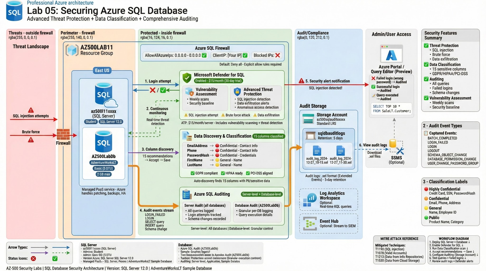

# Lab 05: Securing Azure SQL Database

## 🎯 Objective

Review and implement comprehensive security features for **Azure SQL Database**, focusing on threat protection, data classification, and audit logging for compliance (GDPR, HIPAA, PCI-DSS).

## 🏗️ Architecture



### Components:
- **Azure SQL Server**: Managed database server (az500l11xxxx)
- **Azure SQL Database**: AZ500LabDb (sample database)
- **Microsoft Defender for SQL**: Advanced threat protection
- **Data Discovery & Classification**: GDPR/compliance data labeling
- **SQL Auditing**: Server-level and database-level logging
- **Azure Storage Account**: Audit log storage (5-day retention)

### Security Features Implemented:
- ✅ **Advanced Threat Protection**: SQL injection detection, data exfiltration alerts
- ✅ **Data Classification**: Automatic discovery and labeling of sensitive columns
- ✅ **Server-Level Auditing**: All queries, stored procedures, logins
- ✅ **Database-Level Auditing**: Granular per-database logging
- ✅ **Vulnerability Assessment**: Automated security scans
- ✅ **Firewall Rules**: IP-based access control

---

## 📋 Prerequisites

- Azure subscription with Contributor access
- Azure PowerShell or Azure CLI
- SQL Server Management Studio (SSMS) - optional
- Basic SQL knowledge

---

## 🔧 Lab Setup

### Task 1: Deploy Azure SQL Database (ARM Template)

**Deployment Method**: Azure Portal Custom Template
```json
// See scripts/azuredeploy.json

{
  "$schema": "https://schema.management.azure.com/schemas/2019-04-01/deploymentTemplate.json#",
  "contentVersion": "1.0.0.0",
  "parameters": {
    "serverName": {
      "type": "string",
      "defaultValue": "[concat('az500l11', uniqueString(resourceGroup().id))]",
      "metadata": {
        "description": "The name of the SQL logical server."
      }
    },
    "sqlDBName": {
      "type": "string",
      "defaultValue": "AZ500LabDb",
      "metadata": {
        "description": "The name of the SQL Database."
      }
    },
    "administratorLogin": {
      "type": "string",
      "defaultValue": "Student",
      "metadata": {
        "description": "The administrator username of the SQL logical server."
      }
    },
    "administratorLoginPassword": {
      "type": "securestring",
      "metadata": {
        "description": "The administrator password of the SQL logical server."
      }
    }
  },
  "variables": {},
  "resources": [
    {
      "type": "Microsoft.Sql/servers",
      "apiVersion": "2021-02-01-preview",
      "name": "[parameters('serverName')]",
      "location": "[resourceGroup().location]",
      "properties": {
        "administratorLogin": "[parameters('administratorLogin')]",
        "administratorLoginPassword": "[parameters('administratorLoginPassword')]",
        "version": "12.0"
      },
      "resources": [
        {
          "type": "databases",
          "apiVersion": "2021-02-01-preview",
          "name": "[parameters('sqlDBName')]",
          "location": "[resourceGroup().location]",
          "sku": {
            "name": "Basic",
            "tier": "Basic",
            "capacity": 5
          },
          "dependsOn": [
            "[resourceId('Microsoft.Sql/servers', parameters('serverName'))]"
          ],
          "properties": {
            "collation": "SQL_Latin1_General_CP1_CI_AS",
            "maxSizeBytes": 2147483648,
            "sampleName": "AdventureWorksLT"
          }
        },
        {
          "type": "firewallRules",
          "apiVersion": "2021-02-01-preview",
          "name": "AllowAllAzureIps",
          "location": "[resourceGroup().location]",
          "dependsOn": [
            "[resourceId('Microsoft.Sql/servers', parameters('serverName'))]"
          ],
          "properties": {
            "startIpAddress": "0.0.0.0",
            "endIpAddress": "0.0.0.0"
          }
        }
      ]
    }
  ],
  "outputs": {
    "serverName": {
      "type": "string",
      "value": "[parameters('serverName')]"
    },
    "databaseName": {
      "type": "string",
      "value": "[parameters('sqlDBName')]"
    }
  }
}
```

**Deploy via Portal**:
```
1. Portal → Search "Deploy a custom template"
2. Build your own template in the editor
3. Load file: azuredeploy.json
4. Save
5. Configure:
   - Resource Group: Create new "AZ500LAB11"
   - Location: East US
   - Administrator Password: Pa55w.rd1234 (or your secure password)
6. Review + Create → Create
7. Wait for deployment (~3-5 minutes)
```

**Deploy via PowerShell**:
```powershell
# See scripts/01-deploy-sql-infrastructure.ps1

$resourceGroupName = "AZ500LAB11"
$location = "eastus"
$templateFile = "azuredeploy.json"

# Create Resource Group
New-AzResourceGroup -Name $resourceGroupName -Location $location

# Deploy template
New-AzResourceGroupDeployment `
    -ResourceGroupName $resourceGroupName `
    -TemplateFile $templateFile `
    -administratorLoginPassword (ConvertTo-SecureString "Pa55w.rd1234" -AsPlainText -Force) `
    -Verbose
```

**Validation**:
```powershell
# Verify resources
Get-AzSqlServer -ResourceGroupName "AZ500LAB11"
Get-AzSqlDatabase -ResourceGroupName "AZ500LAB11" -ServerName "az500l11xxxx"

# Expected output:
# ServerName: az500l11xxxx
# DatabaseName: AZ500LabDb
# Status: Online
```

---

### Task 2: Configure Advanced Data Protection (Microsoft Defender for SQL)

**Portal Steps**:
```
1. Portal → Resource Groups → AZ500LAB11
2. Click SQL Server (az500l11xxxx)
3. Security section → Microsoft Defender for Cloud
4. Click "Enable Microsoft Defender for SQL"
5. Wait for notification: "Azure Defender for SQL has been successfully enabled"
6. Click (configure) next to "Microsoft Defender for SQL: Enabled"
7. Review settings:
   - Pricing: ~$15/server/month
   - Trial period: 30 days free
   - Vulnerability Assessment Settings
   - Advanced Threat Protection Settings
8. Back to Microsoft Defender for Cloud blade
9. Review sections:
   - Recommendations (may take 10-15 minutes to populate)
   - Security alerts
```

**PowerShell Configuration**:
```powershell
# See scripts/02-configure-defender.ps1

$resourceGroupName = "AZ500LAB11"
$serverName = "az500l11xxxx"  # Replace with your server name

# Enable Defender for SQL
Update-AzSqlServerAdvancedThreatProtectionSetting `
    -ResourceGroupName $resourceGroupName `
    -ServerName $serverName `
    -NotificationRecipientsEmails "admin@yourdomain.com" `
    -EmailAdmins $true

# Enable Vulnerability Assessment
$storageAccountName = "az500sqlaudit$(Get-Random -Maximum 99999)"
New-AzStorageAccount `
    -ResourceGroupName $resourceGroupName `
    -Name $storageAccountName `
    -Location "eastus" `
    -SkuName Standard_LRS

Update-AzSqlServerVulnerabilityAssessmentSetting `
    -ResourceGroupName $resourceGroupName `
    -ServerName $serverName `
    -StorageAccountName $storageAccountName `
    -RecurringScansInterval Weekly `
    -EmailAdmins $true
```

**Key Features Enabled**:

**Advanced Threat Protection**:
- ✅ SQL injection detection
- ✅ Anomalous database access patterns
- ✅ Potential data exfiltration
- ✅ Brute force attacks
- ✅ Suspicious application access

**Vulnerability Assessment**:
- ✅ Weekly automated scans
- ✅ Security best practices validation
- ✅ Misconfiguration detection
- ✅ Compliance checks (PCI, HIPAA, GDPR)
- ✅ Remediation recommendations

---

### Task 3: Configure Data Classification (Data Discovery & Classification)

**Portal Steps**:
```
1. SQL Server blade → Settings → SQL Databases
2. Select "AZ500LabDb"
3. Security section → Data Discovery & Classification
4. Click "Classification" tab
5. Review message: "We have found 15 columns with classification recommendations"
6. Click blue bar message to view recommendations
7. Review recommended columns:
   - EmailAddress → Confidential - GDPR
   - Phone → Confidential - GDPR
   - PasswordHash → Confidential - Personal
   - etc.
8. Select all checkbox (or select specific columns)
9. Click "Accept Selected Recommendations"
10. Review and adjust:
    - Information Type (e.g., Email, Phone, SSN)
    - Sensitivity Label (Public, General, Confidential, Highly Confidential)
11. Click "Save"
12. Switch to "Overview" tab
13. Review classification statistics and charts
```

**SQL Query to View Classifications**:
```sql
-- See scripts/03-test-queries.sql

-- View classified columns
SELECT 
    SCHEMA_NAME(sys.objects.schema_id) AS SchemaName,
    sys.objects.name AS TableName,
    sys.columns.name AS ColumnName,
    sys.sensitivity_classifications.label AS SensitivityLabel,
    sys.sensitivity_classifications.information_type AS InformationType
FROM sys.sensitivity_classifications
INNER JOIN sys.objects ON sys.sensitivity_classifications.major_id = sys.objects.object_id
INNER JOIN sys.columns ON 
    sys.sensitivity_classifications.major_id = sys.columns.object_id
    AND sys.sensitivity_classifications.minor_id = sys.columns.column_id;

-- Expected output:
-- SchemaName | TableName  | ColumnName     | SensitivityLabel | InformationType
-- -----------|------------|----------------|------------------|----------------
-- SalesLT    | Customer   | EmailAddress   | Confidential     | Contact Info
-- SalesLT    | Customer   | Phone          | Confidential     | Contact Info
-- SalesLT    | Customer   | PasswordHash   | Confidential     | Credentials
```

**Classification Labels**:

| Sensitivity Label | Use Case | Example Columns |
|-------------------|----------|-----------------|
| **Public** | No restrictions | ProductName, CategoryName |
| **General** | Internal use | EmployeeID, OrderID |
| **Confidential** | Restricted access | Email, Phone, Address |
| **Highly Confidential** | Maximum protection | SSN, CreditCard, PasswordHash |

**Information Types**:
- Contact Info (Email, Phone)
- Credentials (Password, API Key)
- Financial (Credit Card, Bank Account)
- National ID (SSN, Passport Number)
- Name (First Name, Last Name)

---

### Task 4: Configure Auditing (Server-Level and Database-Level)

#### **Step 1: Server-Level Auditing**

**Portal Steps**:
```
1. Navigate to SQL Server blade (az500l11xxxx)
2. Security section → Auditing
3. Toggle "Enable Azure SQL Auditing" to ON
4. Select "Storage" checkbox
5. Subscription: Select your subscription
6. Storage Account: Click "Create new"
   - Name: az500sqlaudit[random] (globally unique)
   - Performance: Standard
   - Replication: LRS
   - Click OK
7. Wait for storage account to be created (refresh if needed)
8. Advanced properties:
   - Retention (days): 5
9. Click "Save"
```

**PowerShell Configuration**:
```powershell
# Create storage account for auditing
$storageAccountName = "az500sqlaudit$(Get-Random -Maximum 99999)"
$storageAccount = New-AzStorageAccount `
    -ResourceGroupName "AZ500LAB11" `
    -Name $storageAccountName `
    -Location "eastus" `
    -SkuName Standard_LRS

# Enable server-level auditing
Set-AzSqlServerAudit `
    -ResourceGroupName "AZ500LAB11" `
    -ServerName "az500l11xxxx" `
    -BlobStorageTargetState Enabled `
    -StorageAccountResourceId $storageAccount.Id `
    -RetentionInDays 5
```

**Audit Events Captured** (Server-Level):
- ✅ All queries and stored procedures
- ✅ Successful logins
- ✅ Failed logins
- ✅ Database schema changes (DDL)
- ✅ Permission changes (GRANT, REVOKE)
- ✅ Backup/restore operations

---

#### **Step 2: Database-Level Auditing**

**Portal Steps**:
```
1. SQL Server → Settings → SQL Databases
2. Select "AZ500LabDb"
3. Security section → Auditing
4. Note: "Server-level auditing is already enabled"
5. Options to write audits:
   - ✅ Storage account (already configured at server level)
   - ☐ Log Analytics workspace (optional)
   - ☐ Event Hub (optional)
6. Database-level auditing inherits server settings
7. Can add additional destinations (Log Analytics, Event Hub)
```

**Additional Destination: Log Analytics** (Optional):
```powershell
# Create Log Analytics Workspace
$workspaceName = "AZ500SQLAuditWorkspace"
New-AzOperationalInsightsWorkspace `
    -ResourceGroupName "AZ500LAB11" `
    -Name $workspaceName `
    -Location "eastus" `
    -Sku PerGB2018

# Enable Log Analytics auditing
Set-AzSqlDatabaseAudit `
    -ResourceGroupName "AZ500LAB11" `
    -ServerName "az500l11xxxx" `
    -DatabaseName "AZ500LabDb" `
    -LogAnalyticsTargetState Enabled `
    -WorkspaceResourceId (Get-AzOperationalInsightsWorkspace -ResourceGroupName "AZ500LAB11" -Name $workspaceName).ResourceId
```

---

#### **Step 3: Test Auditing with Query Editor**

**Portal Steps**:

SQL Database (AZ500LabDb) → Overview
Click "Query editor (preview)" (left menu)
Attempt login:

Login: Student
Password: [wrong password]
Result: ❌ Login failed (audited)


Attempt login again:

Login: Student
Password: Pa55w.rd1234
Result: ✅ Login successful (audited)


Run test query:

sql   SELECT TOP 10 * FROM SalesLT.Customer;

Result: Query executed (audited)


Run suspicious query (simulate SQL injection):

SELECT * FROM SalesLT.Customer WHERE EmailAddress = 'test@example.com' OR 1=1;
```
   - Result: Query executed (audited, may trigger Defender alert)
```

---

#### **Step 4: Review Audit Logs**

**Portal Steps**:
```
1. SQL Database → Security → Auditing
2. Click "View audit logs"
3. Switch between:
   - Server audit (all databases)
   - Database audit (AZ500LabDb only)
4. Review audit records:
   - Event Time
   - Action (e.g., SELECT, LOGIN_FAILED, LOGIN)
   - Principal (e.g., Student)
   - Database (e.g., AZ500LabDb)
   - Client IP
   - Statement (full SQL query)
5. Filter by:
   - Time range
   - Event type
   - Principal name
6. Download audit logs (CSV export)
```

**PowerShell to Query Audit Logs**:
```powershell
# See scripts/04-review-audit-logs.ps1

$storageAccountName = "az500sqlauditxxxxx"
$containerName = "sqldbauditlogs"

# Get storage account context
$storageAccount = Get-AzStorageAccount `
    -ResourceGroupName "AZ500LAB11" `
    -Name $storageAccountName

$ctx = $storageAccount.Context

# List audit log blobs
Get-AzStorageBlob -Container $containerName -Context $ctx | 
    Where-Object { $_.Name -like "*AZ500LabDb*" } |
    Select-Object Name, LastModified, Length

# Download latest audit log
$latestBlob = Get-AzStorageBlob -Container $containerName -Context $ctx |
    Sort-Object LastModified -Descending |
    Select-Object -First 1

Get-AzStorageBlobContent `
    -Container $containerName `
    -Blob $latestBlob.Name `
    -Context $ctx `
    -Destination "C:\Temp\audit.xel"

# Parse with SQL Server Extended Events Reader
```

**Sample Audit Log Entries**:
```
Event Time: 2024-12-27 10:15:23
Action: LOGIN_FAILED
Principal: Student
Database: master
Client IP: 20.115.67.89
Statement: N/A
Additional Info: Password incorrect

Event Time: 2024-12-27 10:15:45
Action: LOGIN
Principal: Student
Database: master
Client IP: 20.115.67.89
Statement: N/A

Event Time: 2024-12-27 10:16:12
Action: SELECT
Principal: Student
Database: AZ500LabDb
Client IP: 20.115.67.89
Statement: SELECT TOP 10 * FROM SalesLT.Customer;
```

---

## ✅ Validation

### Test 1: Defender for SQL Recommendations

**Expected Recommendations** (after 10-15 minutes):
- ✅ Enable Transparent Data Encryption (TDE)
- ✅ Enable firewall rules review
- ✅ Enable Advanced Data Security
- ✅ Rotate SQL authentication credentials
- ✅ Implement least-privilege access

**View Recommendations**:
```
SQL Server → Microsoft Defender for Cloud → Recommendations
```

---

### Test 2: Data Classification Validation

**SQL Query**:
```sql
-- Count classified columns
SELECT COUNT(*) AS ClassifiedColumns
FROM sys.sensitivity_classifications;

-- Expected: 15 (if all recommendations accepted)

-- View classification summary
SELECT 
    information_type,
    COUNT(*) AS ColumnCount
FROM sys.sensitivity_classifications
GROUP BY information_type;

-- Expected output:
-- information_type | ColumnCount
-- -----------------|------------
-- Contact Info     | 5
-- Credentials      | 2
-- Name             | 4
-- Financial        | 3
-- Other            | 1
```

---

### Test 3: Audit Log Verification

**PowerShell**:
```powershell
# Check if auditing is enabled
Get-AzSqlServerAudit -ResourceGroupName "AZ500LAB11" -ServerName "az500l11xxxx"

# Expected output:
# BlobStorageTargetState: Enabled
# RetentionInDays: 5
# StorageAccountResourceId: /subscriptions/.../az500sqlauditxxxxx

# Verify database-level auditing
Get-AzSqlDatabaseAudit `
    -ResourceGroupName "AZ500LAB11" `
    -ServerName "az500l11xxxx" `
    -DatabaseName "AZ500LabDb"

# Expected: Inherits server settings or has additional destinations
```

---

## 🔐 Security Best Practices Demonstrated

### Defense-in-Depth Layers:

**Layer 1: Network Security**
- ✅ Firewall rules (IP whitelisting)
- ✅ Private Endpoint support (not configured in lab, but available)
- ✅ Service Endpoints for VNet integration

**Layer 2: Authentication & Authorization**
- ✅ SQL authentication (username/password)
- ✅ Azure AD authentication (recommended, not in lab)
- ✅ Managed Identity support

**Layer 3: Threat Protection**
- ✅ Microsoft Defender for SQL (Advanced Threat Protection)
- ✅ Vulnerability Assessment
- ✅ SQL injection detection
- ✅ Anomalous access pattern detection

**Layer 4: Data Protection**
- ✅ Data Classification (GDPR, HIPAA compliance)
- ✅ Transparent Data Encryption (TDE) - enabled by default
- ✅ Always Encrypted (application-level, not in lab - see Lab 07)

**Layer 5: Audit & Compliance**
- ✅ Server-level auditing (all operations)
- ✅ Database-level auditing (granular logging)
- ✅ 5-day retention (configurable up to 3653 days)
- ✅ Multiple destinations (Storage, Log Analytics, Event Hub)

---

## 🎓 Key Concepts

### Microsoft Defender for SQL

**Components**:
1. **Vulnerability Assessment**:
   - Weekly scans
   - Security baseline checks
   - Compliance reports (PCI, HIPAA, ISO 27001)
   - Remediation guidance

2. **Advanced Threat Protection**:
   - SQL injection attempts
   - Anomalous database access
   - Potential data exfiltration
   - Brute force attacks
   - Suspicious application access

**Pricing**: ~$15/server/month (30-day free trial)

---

### Data Classification

**GDPR Compliance**:
- Right to be forgotten (identify personal data)
- Data portability (know what data you have)
- Breach notification (classify sensitive data)

**Classification Workflow**:
```
1. Discovery → Automatic scan finds sensitive columns
2. Review → Admin reviews recommendations
3. Accept → Apply labels (Sensitivity + Information Type)
4. Audit → Monitor access to classified data
5. Report → Generate compliance reports
```

**Best Practices**:
- ✅ Classify data at ingestion
- ✅ Review classifications quarterly
- ✅ Automate classification with policies
- ✅ Integrate with DLP (Data Loss Prevention)

---

### SQL Auditing

**Server-Level vs Database-Level**:

| Aspect | Server-Level | Database-Level |
|--------|--------------|----------------|
| **Scope** | All databases | Single database |
| **Events** | All operations | Database-specific |
| **Config Location** | SQL Server | SQL Database |
| **Inheritance** | N/A | Can inherit server settings |
| **Use Case** | Centralized logging | Granular control |

**Audit Destinations**:
1. **Storage Account** (Lab 05):
   - Long-term retention
   - Cost-effective
   - Manual analysis (download .xel files)

2. **Log Analytics** (Optional):
   - KQL queries
   - Real-time dashboards
   - Integration with Sentinel
   - Alerting

3. **Event Hub** (Optional):
   - Streaming to SIEM
   - Real-time processing
   - Third-party integrations

---

## 🛠️ Skills Demonstrated

- Azure SQL Database deployment (ARM templates)
- Microsoft Defender for SQL configuration
- Vulnerability Assessment setup
- Data Discovery & Classification (GDPR compliance)
- Sensitivity labeling and information types
- Server-level and database-level auditing
- Audit log storage and retention configuration
- SQL query execution and monitoring
- Threat detection and security alerting
- Compliance reporting (PCI, HIPAA, GDPR)

---

## 🎯 MITRE ATT&CK Mapping

### Techniques Mitigated:

**T1190 - Exploit Public-Facing Application**
- Mitigation: SQL injection detection (Defender for SQL)
- Detection: Anomalous query patterns

**T1078 - Valid Accounts**
- Detection: Failed login attempts audited
- Mitigation: Brute force attack detection

**T1213 - Data from Information Repositories**
- Detection: Data exfiltration detection (Defender)
- Mitigation: Audit logging (who accessed what data)

**T1530 - Data from Cloud Storage**
- Mitigation: Access auditing and classification
- Detection: Anomalous data access patterns

**T1098 - Account Manipulation**
- Detection: Permission changes audited
- Logging: GRANT/REVOKE operations logged

---

## 💡 Real-World Use Cases

### Healthcare (HIPAA Compliance):
```
Challenge: Protect patient health information (PHI)
Solution:
- Data Classification: Label PHI columns (SSN, MedicalRecordNumber)
- Auditing: Track all access to patient records
- Defender: Detect unauthorized access attempts
- Vulnerability Assessment: Ensure HIPAA compliance

Result: Audit-ready, compliant database
```

---

### Finance (PCI-DSS Compliance):
```
Challenge: Protect credit card data (PCI-DSS Level 1)
Solution:
- Data Classification: Mark credit card columns as "Highly Confidential"
- Always Encrypted: Encrypt credit card numbers (see Lab 07)
- Auditing: Log all transactions
- Defender: SQL injection protection

Result: PCI-DSS compliant payment processing
```

---

### E-Commerce (GDPR Compliance):
```
Challenge: Right to be forgotten, data portability
Solution:
- Data Classification: Identify all personal data (email, phone, address)
- Auditing: Track data access for breach notification
- Defender: Prevent data exfiltration
- Automated reports: GDPR compliance dashboard

Result: GDPR-ready customer data management
```

---

## 📚 Additional Resources

- [Microsoft Defender for SQL Documentation](https://learn.microsoft.com/en-us/azure/azure-sql/database/azure-defender-for-sql)
- [Data Discovery & Classification](https://learn.microsoft.com/en-us/azure/azure-sql/database/data-discovery-and-classification-overview)
- [SQL Database Auditing](https://learn.microsoft.com/en-us/azure/azure-sql/database/auditing-overview)
- [Vulnerability Assessment](https://learn.microsoft.com/en-us/azure/azure-sql/database/sql-vulnerability-assessment)

---

## 🧹 Cleanup
```powershell
# Remove all lab resources
Remove-AzResourceGroup -Name "AZ500LAB11" -Force -AsJob

# Verify deletion
Get-AzResourceGroup -Name "AZ500LAB11" -ErrorAction SilentlyContinue
# Should return: null (resource group deleted)
```

---

## 📝 Notes

### Data Classification Recommendations:
- Lab finds **15 columns** with classification recommendations
- Most common: Contact Info, Credentials, Name, Financial
- **Always review** before accepting all recommendations
- Custom labels can be created for specific compliance needs

### Audit Log Retention:
- **Lab**: 5 days (demo/testing)
- **Production**: 90-365 days (compliance requirements)
- **Maximum**: 3653 days (~10 years)
- **Cost**: ~$0.10/GB/month (Storage Account pricing)

### Defender for SQL Pricing:
- **Server-level**: $15/server/month
- **Database-level**: Not applicable (enabled at server)
- **Free trial**: 30 days
- **Included**: Vulnerability Assessment + Advanced Threat Protection

### Storage Account Naming:
- Must be **globally unique** across all Azure
- 3-24 characters, lowercase + digits only
- Lab uses: `az500sqlaudit[random]`
- Recommendation: Use consistent naming convention

---

**Lab Status**: ✅ Completed  
**Documentation**: README + Scripts + ARM Template  
**MITRE Mapping**: Included  
**Difficulty**: ⭐⭐⭐ (Intermediate)
