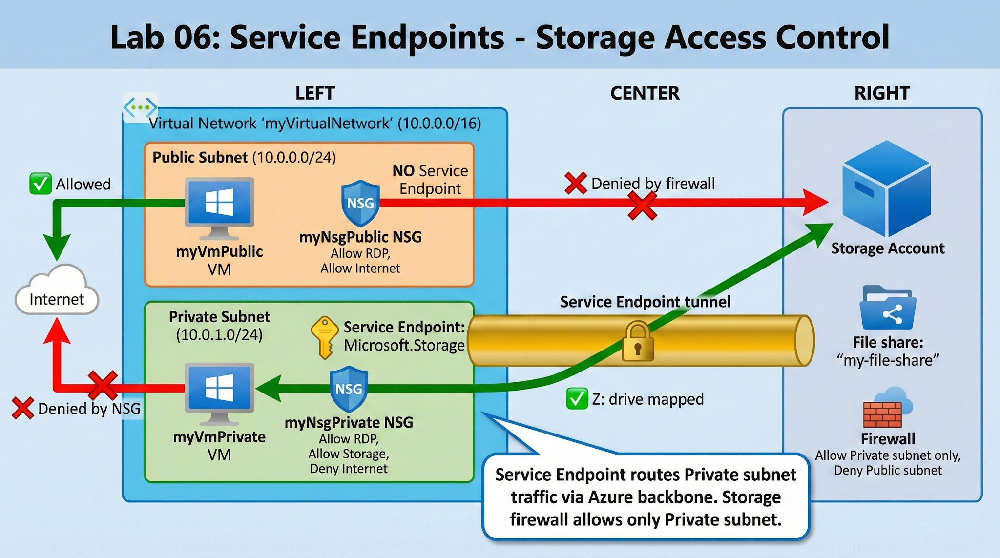

# Lab 06: Service Endpoints and Securing Storage

## 🎯 Objective

Create a proof of concept to demonstrate securing Azure file shares using Service Endpoints:
- Create a storage endpoint so traffic stays within Azure backbone network
- Configure storage endpoint so only Private subnet can access storage
- Confirm Public subnet cannot access storage

## 🏗️ Architecture



**Components:**
- Virtual Network: myVirtualNetwork (10.0.0.0/16)
  - Public Subnet: 10.0.0.0/24
  - Private Subnet: 10.0.1.0/24 (with Service Endpoint: Microsoft.Storage)
- NSGs: myNsgPublic, myNsgPrivate
- Storage Account with file share: my-file-share
- VMs: myVmPublic, myVmPrivate

**Access Matrix:**

| VM | Internet | Storage | Why |
|---|---|---|---|
| myVmPrivate | ❌ Denied | ✅ Allowed | Service Endpoint + Storage firewall allows Private subnet only |
| myVmPublic | ✅ Allowed | ❌ Denied | No Service Endpoint, Storage firewall blocks Public subnet |

---

## 📋 Lab Tasks

### Task 1: Create Virtual Network
```powershell
# See scripts/01-create-vnet.ps1

# Create Resource Group
New-AzResourceGroup -Name "AZ500LAB12" -Location "eastus"

# Create VNet with Public subnet
$publicSubnet = New-AzVirtualNetworkSubnetConfig `
    -Name "Public" `
    -AddressPrefix "10.0.0.0/24"

New-AzVirtualNetwork `
    -ResourceGroupName "AZ500LAB12" `
    -Location "eastus" `
    -Name "myVirtualNetwork" `
    -AddressPrefix "10.0.0.0/16" `
    -Subnet $publicSubnet
```

---

### Task 2: Add Private Subnet
```powershell
# Add Private subnet (Service Endpoint configured later in Task 5)
$vnet = Get-AzVirtualNetwork -ResourceGroupName "AZ500LAB12" -Name "myVirtualNetwork"

Add-AzVirtualNetworkSubnetConfig `
    -Name "Private" `
    -AddressPrefix "10.0.1.0/24" `
    -VirtualNetwork $vnet

$vnet | Set-AzVirtualNetwork
```

**Note:** Service Endpoints left as None initially, configured in Task 5 with storage.

---

### Task 3: Configure myNsgPrivate
```powershell
# See scripts/02-create-nsg-private.ps1

# Create NSG
$nsg = New-AzNetworkSecurityGroup `
    -ResourceGroupName "AZ500LAB12" `
    -Location "eastus" `
    -Name "myNsgPrivate"

# Outbound: Allow Storage (Priority 1000)
$nsg | Add-AzNetworkSecurityRuleConfig `
    -Name "Allow-Storage-All" `
    -Access Allow `
    -Protocol * `
    -Direction Outbound `
    -Priority 1000 `
    -SourceAddressPrefix VirtualNetwork `
    -SourcePortRange * `
    -DestinationAddressPrefix Storage `
    -DestinationPortRange * | Set-AzNetworkSecurityGroup

# Outbound: Deny Internet (Priority 1100)
$nsg | Add-AzNetworkSecurityRuleConfig `
    -Name "Deny-Internet-All" `
    -Access Deny `
    -Protocol * `
    -Direction Outbound `
    -Priority 1100 `
    -SourceAddressPrefix VirtualNetwork `
    -SourcePortRange * `
    -DestinationAddressPrefix Internet `
    -DestinationPortRange * | Set-AzNetworkSecurityGroup

# Inbound: Allow RDP (Priority 1200)
$nsg | Add-AzNetworkSecurityRuleConfig `
    -Name "Allow-RDP-All" `
    -Access Allow `
    -Protocol Tcp `
    -Direction Inbound `
    -Priority 1200 `
    -SourceAddressPrefix * `
    -SourcePortRange * `
    -DestinationAddressPrefix VirtualNetwork `
    -DestinationPortRange 3389 | Set-AzNetworkSecurityGroup

# Associate with Private subnet
$vnet = Get-AzVirtualNetwork -ResourceGroupName "AZ500LAB12" -Name "myVirtualNetwork"
Set-AzVirtualNetworkSubnetConfig `
    -VirtualNetwork $vnet `
    -Name "Private" `
    -AddressPrefix "10.0.1.0/24" `
    -NetworkSecurityGroup $nsg
$vnet | Set-AzVirtualNetwork
```

---

### Task 4: Configure myNsgPublic
```powershell
# See scripts/03-create-nsg-public.ps1

# Create NSG
$nsgPublic = New-AzNetworkSecurityGroup `
    -ResourceGroupName "AZ500LAB12" `
    -Location "eastus" `
    -Name "myNsgPublic"

# Inbound: Allow RDP (Priority 1200)
$nsgPublic | Add-AzNetworkSecurityRuleConfig `
    -Name "Allow-RDP-All" `
    -Access Allow `
    -Protocol Tcp `
    -Direction Inbound `
    -Priority 1200 `
    -SourceAddressPrefix * `
    -SourcePortRange * `
    -DestinationAddressPrefix VirtualNetwork `
    -DestinationPortRange 3389 | Set-AzNetworkSecurityGroup

# Associate with Public subnet
$vnet = Get-AzVirtualNetwork -ResourceGroupName "AZ500LAB12" -Name "myVirtualNetwork"
Set-AzVirtualNetworkSubnetConfig `
    -VirtualNetwork $vnet `
    -Name "Public" `
    -AddressPrefix "10.0.0.0/24" `
    -NetworkSecurityGroup $nsgPublic
$vnet | Set-AzVirtualNetwork
```

---

### Task 5: Create Storage Account with File Share
```powershell
# See scripts/04-create-storage.ps1

# Create storage account
$storageAccountName = "az500lab12st$(Get-Random -Maximum 99999)"

$storageAccount = New-AzStorageAccount `
    -ResourceGroupName "AZ500LAB12" `
    -Name $storageAccountName `
    -Location "eastus" `
    -SkuName Standard_LRS `
    -Kind StorageV2

# Create file share
$ctx = $storageAccount.Context
New-AzStorageShare -Name "my-file-share" -Context $ctx

# Enable Service Endpoint on Private subnet
$vnet = Get-AzVirtualNetwork -ResourceGroupName "AZ500LAB12" -Name "myVirtualNetwork"
$nsg = Get-AzNetworkSecurityGroup -Name "myNsgPrivate" -ResourceGroupName "AZ500LAB12"

Set-AzVirtualNetworkSubnetConfig `
    -VirtualNetwork $vnet `
    -Name "Private" `
    -AddressPrefix "10.0.1.0/24" `
    -ServiceEndpoint "Microsoft.Storage" `
    -NetworkSecurityGroup $nsg
$vnet | Set-AzVirtualNetwork

# Configure storage firewall: Allow only Private subnet
$subnet = Get-AzVirtualNetwork -ResourceGroupName "AZ500LAB12" -Name "myVirtualNetwork" | 
    Get-AzVirtualNetworkSubnetConfig -Name "Private"

Add-AzStorageAccountNetworkRule `
    -ResourceGroupName "AZ500LAB12" `
    -Name $storageAccountName `
    -VirtualNetworkResourceId $subnet.Id

Update-AzStorageAccountNetworkRuleSet `
    -ResourceGroupName "AZ500LAB12" `
    -Name $storageAccountName `
    -DefaultAction Deny

Write-Host "Storage Account: $storageAccountName"
```

**Get drive mapping script:**
```
Portal → Storage Account → File Shares → my-file-share → Connect → Windows tab
Copy PowerShell script for use in Task 7
```

---

### Task 6: Deploy Virtual Machines
```powershell
# See scripts/05-deploy-vms.ps1

$credential = Get-Credential -Message "Enter VM credentials (Username: Student)"
$vnet = Get-AzVirtualNetwork -ResourceGroupName "AZ500LAB12" -Name "myVirtualNetwork"

# --- myVmPrivate (Private subnet) ---
$privateSubnet = Get-AzVirtualNetworkSubnetConfig -VirtualNetwork $vnet -Name "Private"

$pipPrivate = New-AzPublicIpAddress `
    -ResourceGroupName "AZ500LAB12" `
    -Location "eastus" `
    -Name "myVmPrivate-ip" `
    -AllocationMethod Dynamic

$nicPrivate = New-AzNetworkInterface `
    -ResourceGroupName "AZ500LAB12" `
    -Location "eastus" `
    -Name "myVmPrivate-nic" `
    -SubnetId $privateSubnet.Id `
    -PublicIpAddressId $pipPrivate.Id

$vmConfigPrivate = New-AzVMConfig -VMName "myVmPrivate" -VMSize "Standard_DS1_v2" |
    Set-AzVMOperatingSystem -Windows -ComputerName "myVmPrivate" -Credential $credential |
    Set-AzVMSourceImage -PublisherName MicrosoftWindowsServer -Offer WindowsServer `
        -Skus 2022-datacenter-azure-edition -Version latest |
    Add-AzVMNetworkInterface -Id $nicPrivate.Id |
    Set-AzVMOSDisk -StorageAccountType StandardSSD_LRS -CreateOption FromImage

New-AzVM -ResourceGroupName "AZ500LAB12" -Location "eastus" -VM $vmConfigPrivate

# --- myVmPublic (Public subnet) ---
$publicSubnet = Get-AzVirtualNetworkSubnetConfig -VirtualNetwork $vnet -Name "Public"

$pipPublic = New-AzPublicIpAddress `
    -ResourceGroupName "AZ500LAB12" `
    -Location "eastus" `
    -Name "myVmPublic-ip" `
    -AllocationMethod Dynamic

$nicPublic = New-AzNetworkInterface `
    -ResourceGroupName "AZ500LAB12" `
    -Location "eastus" `
    -Name "myVmPublic-nic" `
    -SubnetId $publicSubnet.Id `
    -PublicIpAddressId $pipPublic.Id

$vmConfigPublic = New-AzVMConfig -VMName "myVmPublic" -VMSize "Standard_DS1_v2" |
    Set-AzVMOperatingSystem -Windows -ComputerName "myVmPublic" -Credential $credential |
    Set-AzVMSourceImage -PublisherName MicrosoftWindowsServer -Offer WindowsServer `
        -Skus 2022-datacenter-azure-edition -Version latest |
    Add-AzVMNetworkInterface -Id $nicPublic.Id |
    Set-AzVMOSDisk -StorageAccountType StandardSSD_LRS -CreateOption FromImage

New-AzVM -ResourceGroupName "AZ500LAB12" -Location "eastus" -VM $vmConfigPublic
```

---

### Task 7: Test from myVmPrivate (✅ Storage Allowed, ❌ Internet Denied)

**Steps:**
1. Portal → VMs → myVmPrivate → Connect → RDP
2. Login: Student / [your password]
3. Start → Windows PowerShell ISE
4. Paste drive mapping script from Task 5 (Storage → my-file-share → Connect)
5. Run script → **Result: Z: drive mapped successfully ✅**
6. Test Internet: `Test-NetConnection -ComputerName www.bing.com -Port 80`
   - **Result: TcpTestSucceeded = False ❌** (NSG blocks)

---

### Task 8: Test from myVmPublic (❌ Storage Denied, ✅ Internet Allowed)

**Steps:**
1. Portal → VMs → myVmPublic → Connect → RDP
2. Login: Student / [your password]
3. Start → Windows PowerShell ISE
4. Paste same drive mapping script
5. Run script → **Result: New-PSDrive : Access is denied ❌**
6. Test Internet: `Test-NetConnection -ComputerName www.bing.com -Port 80`
   - **Result: TcpTestSucceeded = True ✅** (NSG allows)

---

## ✅ Validation

**Expected Results:**

| VM | Storage Access | Internet Access |
|---|---|---|
| myVmPrivate | ✅ Allowed (Service Endpoint + Firewall) | ❌ Denied (NSG blocks) |
| myVmPublic | ❌ Denied (Firewall blocks) | ✅ Allowed (NSG allows) |

---

## 🧹 Cleanup
```powershell
# See scripts/cleanup.ps1
Remove-AzResourceGroup -Name "AZ500LAB12" -Force -AsJob
```

---

## 🎓 Key Concepts

**Service Endpoint:**
- Routes traffic via Azure backbone network (not Internet)
- Enabled per subnet
- Traffic to Storage stays within Azure

**Storage Firewall:**
- Default action: Deny
- Allow rules: Virtual networks/subnets only
- Public subnet blocked despite being in same VNet

**NSG Rules (myNsgPrivate):**
- Priority 1000: Allow Storage ✅
- Priority 1100: Deny Internet ❌
- Priority 1200: Allow RDP ✅

---

**Lab completed successfully when:**
- myVmPrivate maps Z: drive ✅
- myVmPrivate cannot reach bing.com ❌
- myVmPublic cannot map Z: drive ❌
- myVmPublic can reach bing.com ✅
