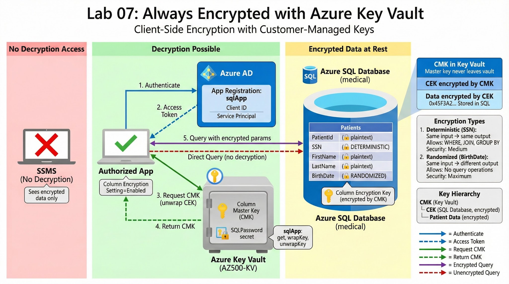

# Lab 07: Azure Key Vault + Always Encrypted

## 🎯 Objective

Secure sensitive data in Azure SQL Database using **Always Encrypted** with customer-managed keys stored in **Azure Key Vault**. Demonstrate end-to-end column-level encryption with transparent client-side decryption for authorized applications.

## 🏗️ Architecture



### Components:
- **Azure Key Vault**: Stores Column Master Key (CMK)
- **Azure AD App Registration**: Application authentication
- **Azure SQL Database**: Medical data with encrypted columns
- **Console Application**: Authorized app with transparent decryption
- **Always Encrypted**: Column-level encryption (Deterministic + Randomized)

### Key Hierarchy:
```
Column Master Key (CMK)
  └─ Stored in Azure Key Vault
     └─ Column Encryption Key (CEK)
        └─ Stored in SQL Database (encrypted by CMK)
           └─ Patient Data (SSN, BirthDate)
              └─ Encrypted by CEK
```

---

## 📋 Prerequisites

- Azure subscription with Contributor access
- SQL Server Management Studio (SSMS) installed
- Visual Studio or .NET SDK
- PowerShell 7+ with Az module

---

## 🔧 Lab Setup

### Task 1: Create Azure Key Vault
```powershell
# See scripts/01-setup-keyvault.ps1

# Create Resource Group
$rgName = "AZ500LAB07"
$location = "EastUS"
New-AzResourceGroup -Name $rgName -Location $location

# Create Key Vault
$kvName = "AZ500-KV-$(Get-Random)"
New-AzKeyVault `
    -ResourceGroupName $rgName `
    -VaultName $kvName `
    -Location $location `
    -EnabledForDiskEncryption `
    -EnabledForTemplateDeployment `
    -EnableSoftDelete `
    -SoftDeleteRetentionInDays 90

# Create Column Master Key
$keyName = "MyLabKey"
Add-AzKeyVaultKey `
    -VaultName $kvName `
    -Name $keyName `
    -Destination Software

# Create Secret for SQL Password
$sqlPassword = ConvertTo-SecureString "P@ssw0rd123!" -AsPlainText -Force
Set-AzKeyVaultSecret `
    -VaultName $kvName `
    -Name "SQLPassword" `
    -SecretValue $sqlPassword
```

---

### Task 2: Create Azure AD App Registration
```powershell
# Register application
$appName = "sqlApp"
$app = New-AzADApplication -DisplayName $appName

# Create service principal
$sp = New-AzADServicePrincipal -ApplicationId $app.AppId

# Create client secret
$secret = New-AzADAppCredential -ApplicationId $app.AppId

# Configure Key Vault access policy
Set-AzKeyVaultAccessPolicy `
    -VaultName $kvName `
    -ServicePrincipalName $app.AppId `
    -PermissionsToKeys get, wrapKey, unwrapKey `
    -PermissionsToSecrets get

# Save credentials (for app configuration)
Write-Host "Application ID: $($app.AppId)"
Write-Host "Client Secret: $($secret.SecretText)"
Write-Host "Tenant ID: $((Get-AzContext).Tenant.Id)"
```

---

### Task 3: Create Azure SQL Database
```powershell
# Create SQL Server
$sqlServerName = "az500-sql-$(Get-Random)"
$sqlAdminUser = "sqladmin"
$sqlAdminPassword = "P@ssw0rd123!"

New-AzSqlServer `
    -ResourceGroupName $rgName `
    -ServerName $sqlServerName `
    -Location $location `
    -SqlAdministratorCredentials (New-Object PSCredential($sqlAdminUser, (ConvertTo-SecureString $sqlAdminPassword -AsPlainText -Force)))

# Configure firewall (allow Azure services)
New-AzSqlServerFirewallRule `
    -ResourceGroupName $rgName `
    -ServerName $sqlServerName `
    -FirewallRuleName "AllowAzureServices" `
    -StartIpAddress "0.0.0.0" `
    -EndIpAddress "0.0.0.0"

# Add your client IP
$myIp = (Invoke-WebRequest -Uri "https://ifconfig.me/ip").Content.Trim()
New-AzSqlServerFirewallRule `
    -ResourceGroupName $rgName `
    -ServerName $sqlServerName `
    -FirewallRuleName "AllowClientIP" `
    -StartIpAddress $myIp `
    -EndIpAddress $myIp

# Create database
$databaseName = "medical"
New-AzSqlDatabase `
    -ResourceGroupName $rgName `
    -ServerName $sqlServerName `
    -DatabaseName $databaseName `
    -Edition "Basic"
```

---

### Task 4: Configure Always Encrypted (SSMS)

**Step 1: Create Table with Encrypted Columns**
```sql
-- See scripts/02-create-sql-database.sql

USE medical;
GO

CREATE TABLE Patients (
    PatientId INT IDENTITY(1,1) PRIMARY KEY,
    SSN CHAR(11) COLLATE Latin1_General_BIN2 
        ENCRYPTED WITH (
            ENCRYPTION_TYPE = DETERMINISTIC,
            ALGORITHM = 'AEAD_AES_256_CBC_HMAC_SHA_256',
            COLUMN_ENCRYPTION_KEY = CEK_Auto1
        ) NOT NULL,
    FirstName VARCHAR(50) NOT NULL,
    LastName VARCHAR(50) NOT NULL,
    BirthDate DATE 
        ENCRYPTED WITH (
            ENCRYPTION_TYPE = RANDOMIZED,
            ALGORITHM = 'AEAD_AES_256_CBC_HMAC_SHA_256',
            COLUMN_ENCRYPTION_KEY = CEK_Auto1
        ) NOT NULL
);
GO
```

**Step 2: Configure Column Master Key (SSMS)**

1. Connect to SQL Database in SSMS
2. Expand Database → Security → Always Encrypted Keys
3. Right-click **Column Master Keys** → New Column Master Key
4. Name: `CMK_Auto1`
5. Key Store: **Azure Key Vault**
6. Sign in with Azure AD
7. Select Key Vault → Select Key: `MyLabKey`
8. Click OK

**Step 3: Configure Column Encryption Key**

1. Right-click **Column Encryption Keys** → New Column Encryption Key
2. Name: `CEK_Auto1`
3. Column Master Key: `CMK_Auto1`
4. Click OK (auto-generated encrypted value)

---

### Task 5: Insert Sample Data

**From SSMS (sees encrypted data):**
```sql
-- Insert via SSMS (Column Encryption Setting = Disabled)
INSERT INTO Patients (SSN, FirstName, LastName, BirthDate)
VALUES 
    ('999-99-0001', 'John', 'Doe', '1985-05-15'),
    ('999-99-0002', 'Jane', 'Smith', '1990-08-22'),
    ('999-99-0003', 'Alice', 'Johnson', '1978-12-03');

-- Query from SSMS (sees encrypted binary data)
SELECT * FROM Patients;
-- Result: SSN and BirthDate show as 0x45F3A2B1C4... (encrypted)
```

---

### Task 6: Create Authorized Application

**Program.cs** (see `scripts/04-test-app/Program.cs`):
```csharp
using System;
using System.Data.SqlClient;
using Microsoft.IdentityModel.Clients.ActiveDirectory;

namespace AlwaysEncryptedApp
{
    class Program
    {
        static void Main(string[] args)
        {
            // Azure AD authentication
            string clientId = "YOUR_APP_ID";
            string clientSecret = "YOUR_CLIENT_SECRET";
            string tenantId = "YOUR_TENANT_ID";
            
            // SQL connection with Always Encrypted enabled
            string connectionString = 
                "Server=tcp:az500-sql-xxxxx.database.windows.net,1433;" +
                "Database=medical;" +
                "User ID=sqladmin;" +
                "Password=P@ssw0rd123!;" +
                "Column Encryption Setting=Enabled;";

            // Register Key Store Provider for Azure Key Vault
            SqlColumnEncryptionAzureKeyVaultProvider azureKeyVaultProvider = 
                new SqlColumnEncryptionAzureKeyVaultProvider(GetToken);
            
            Dictionary<string, SqlColumnEncryptionKeyStoreProvider> providers = 
                new Dictionary<string, SqlColumnEncryptionKeyStoreProvider>
                {
                    { SqlColumnEncryptionAzureKeyVaultProvider.ProviderName, azureKeyVaultProvider }
                };
            
            SqlConnection.RegisterColumnEncryptionKeyStoreProviders(providers);

            // Query with transparent decryption
            using (SqlConnection connection = new SqlConnection(connectionString))
            {
                connection.Open();
                
                Console.Write("Enter SSN to search: ");
                string searchSSN = Console.ReadLine();

                string query = "SELECT * FROM Patients WHERE SSN = @SSN";
                SqlCommand command = new SqlCommand(query, connection);
                command.Parameters.AddWithValue("@SSN", searchSSN);

                using (SqlDataReader reader = command.ExecuteReader())
                {
                    if (reader.Read())
                    {
                        Console.WriteLine($"\nPatient Found:");
                        Console.WriteLine($"SSN: {reader["SSN"]}");
                        Console.WriteLine($"Name: {reader["FirstName"]} {reader["LastName"]}");
                        Console.WriteLine($"Birth Date: {reader["BirthDate"]:yyyy-MM-dd}");
                    }
                    else
                    {
                        Console.WriteLine("No patient found with that SSN.");
                    }
                }
            }
        }

        // Token callback for Azure Key Vault authentication
        private static async Task<string> GetToken(string authority, string resource, string scope)
        {
            string clientId = "YOUR_APP_ID";
            string clientSecret = "YOUR_CLIENT_SECRET";
            
            var authContext = new AuthenticationContext(authority);
            ClientCredential clientCred = new ClientCredential(clientId, clientSecret);
            AuthenticationResult result = await authContext.AcquireTokenAsync(resource, clientCred);
            
            return result.AccessToken;
        }
    }
}
```

---

## ✅ Validation

### Test 1: Query from SSMS (No Decryption)
```sql
-- SSMS without Column Encryption Setting
SELECT * FROM Patients WHERE PatientId = 1;

-- Result:
-- SSN: 0x01A3F5B2C8D4E6F7... (encrypted binary)
-- BirthDate: 0x02F4A6B8C0D2E4... (encrypted binary)
```

**Expected**: Encrypted data displayed as binary (no decryption)

---

### Test 2: Query from Authorized App (Transparent Decryption)
```
Enter SSN to search: 999-99-0003

Patient Found:
SSN: 999-99-0003
Name: Alice Johnson
Birth Date: 1978-12-03
```

**Expected**: Plaintext data (transparent decryption via Key Vault access)

---

### Test 3: Query from Unauthorized App

Remove Key Vault access policy from app:
```powershell
Remove-AzKeyVaultAccessPolicy `
    -VaultName $kvName `
    -ServicePrincipalName $app.AppId
```

Run application:
```
Error: Failed to decrypt a column encryption key using key store provider 'AZURE_KEY_VAULT'.
```

**Expected**: Decryption fails without Key Vault access

---

## 🔐 Security Validation

### Key Protection:
- ✅ Column Master Key (CMK) never leaves Key Vault
- ✅ Column Encryption Key (CEK) encrypted by CMK
- ✅ Encryption/decryption happens client-side (not in SQL)

### Access Control:
- ✅ Only apps with Key Vault access can decrypt
- ✅ SSMS without permission sees encrypted data
- ✅ SQL Server admin cannot decrypt (no CMK access)

### Data Protection:
- ✅ SSN: Deterministic encryption (allows WHERE, JOIN, GROUP BY)
- ✅ BirthDate: Randomized encryption (maximum security, no queries on encrypted value)

---

## 🎓 Key Concepts

### Always Encrypted Encryption Types:

**Deterministic Encryption**:
- Same plaintext → same ciphertext
- Allows: `WHERE`, `JOIN`, `GROUP BY`, `DISTINCT`
- Use case: SSN, Employee ID (lookup queries)
- Security: Lower (pattern analysis possible)

**Randomized Encryption**:
- Same plaintext → different ciphertext each time
- Allows: No query operations on encrypted value
- Use case: Salary, Birth Date (maximum security)
- Security: Higher (no pattern analysis)

### Key Hierarchy:
```
Column Master Key (CMK)
├─ Stored in: Azure Key Vault, Certificate Store, Windows Certificate Store
├─ Purpose: Encrypts Column Encryption Keys
└─ Access: Controlled by Key Vault access policies

Column Encryption Key (CEK)
├─ Stored in: SQL Database metadata (encrypted by CMK)
├─ Purpose: Encrypts actual data
└─ Access: Automatically managed by Always Encrypted driver

Patient Data (SSN, BirthDate)
├─ Encrypted by: CEK
├─ Decryption: Client-side (SQL Server never sees plaintext)
└─ Access: Requires both SQL access + Key Vault access
```

---

## 💡 Real-World Use Cases

### Healthcare (HIPAA Compliance):
- **SSN** (Deterministic): Patient lookup by SSN
- **Medical Record Number** (Deterministic): Cross-system queries
- **Diagnosis** (Randomized): Maximum privacy protection

### Finance (PCI-DSS Compliance):
- **Credit Card Number** (Deterministic): Transaction lookup
- **CVV** (Randomized): No queries needed, maximum security
- **Account Balance** (Randomized): Sensitive financial data

### HR Systems:
- **Employee ID** (Deterministic): Payroll queries
- **Salary** (Randomized): Confidential compensation data
- **Performance Review** (Randomized): Privacy protection

---

## 🛠️ Skills Demonstrated

- Azure Key Vault configuration and access policies
- Always Encrypted column-level encryption
- Azure AD App Registration for service authentication
- Customer-managed key (CMK) lifecycle
- Client-side encryption/decryption
- Deterministic vs Randomized encryption selection
- Secure connection strings with Column Encryption Setting
- Data protection compliance (HIPAA, PCI-DSS, GDPR)

---

## 🎯 MITRE ATT&CK Mapping

### Techniques Mitigated:

**T1005 - Data from Local System**
- Mitigation: Data encrypted at rest, unusable without Key Vault access

**T1552 - Unsecured Credentials**
- Mitigation: Credentials (SSN, PII) encrypted, keys in Key Vault

**T1078 - Valid Accounts**
- Detection: Even with SQL access, data remains encrypted without Key Vault permissions

**T1213 - Data from Information Repositories**
- Mitigation: Database compromise doesn't expose plaintext data

---

## 📚 Additional Resources

- [Always Encrypted Documentation](https://learn.microsoft.com/en-us/sql/relational-databases/security/encryption/always-encrypted-database-engine)
- [Azure Key Vault Overview](https://learn.microsoft.com/en-us/azure/key-vault/general/overview)
- [Customer-Managed Keys Best Practices](https://learn.microsoft.com/en-us/azure/security/fundamentals/data-encryption-best-practices)

---

## 🧹 Cleanup
```powershell
# Remove all lab resources
Remove-AzResourceGroup -Name "AZ500LAB07" -Force
Remove-AzADApplication -ApplicationId $app.AppId
```

---

## 📝 Notes

- Always Encrypted requires **client-side driver support** (.NET, JDBC, ODBC)
- SQL Server **never sees plaintext** data (encryption/decryption happens on client)
- CMK rotation requires re-encrypting all CEKs (plan maintenance windows)
- Query performance: Deterministic allows indexing, Randomized does not
- Application changes: Connection string must include `Column Encryption Setting=Enabled`

---

**Lab Status**: ✅ Completed  
**Documentation**: README + Scripts + Sample App  
**MITRE Mapping**: Included  
**Difficulty**: ⭐⭐⭐⭐ (Advanced)
```

---

## 🎨 **Architecture Diagram Prompt (Napkin.ai / Excalidraw)**
```
Create an architecture diagram showing:

Components (left to right):
1. Console Application (.NET)
   - Icon: Computer/laptop
   - Label: "Authorized App"
   - Note: "Column Encryption Setting=Enabled"

2. Azure AD App Registration
   - Icon: Shield with key
   - Label: "sqlApp (Service Principal)"
   - Connection: From app → Azure AD (authentication)

3. Azure Key Vault
   - Icon: Vault/safe
   - Label: "AZ500-KV"
   - Contains: "Column Master Key (CMK)"
   - Access Policy: "sqlApp: get, wrapKey, unwrapKey"

4. Azure SQL Database
   - Icon: Database cylinder
   - Label: "medical database"
   - Tables: "Patients table"
   - Contains: "Column Encryption Key (CEK) - encrypted by CMK"

Data Flow:
1. App → Azure AD (authenticate)
2. App → Azure SQL (encrypted connection)
3. App → Key Vault (get CMK for CEK decryption)
4. Bidirectional: App ↔ SQL (encrypted queries, transparent decryption)

Encryption layers (show visually):
- Layer 1: Data encrypted by CEK in SQL
- Layer 2: CEK encrypted by CMK in Key Vault
- Client-side: App decrypts using CEK (after unwrapping CEK with CMK from Key Vault)

Security boundaries (color code):
- Green: Authorized app (has Key Vault access)
- Red: SSMS without access (sees encrypted data only)
- Yellow: SQL Server admin (cannot decrypt without CMK)

Style: Modern, clean, professional
Colors: Azure blue theme
