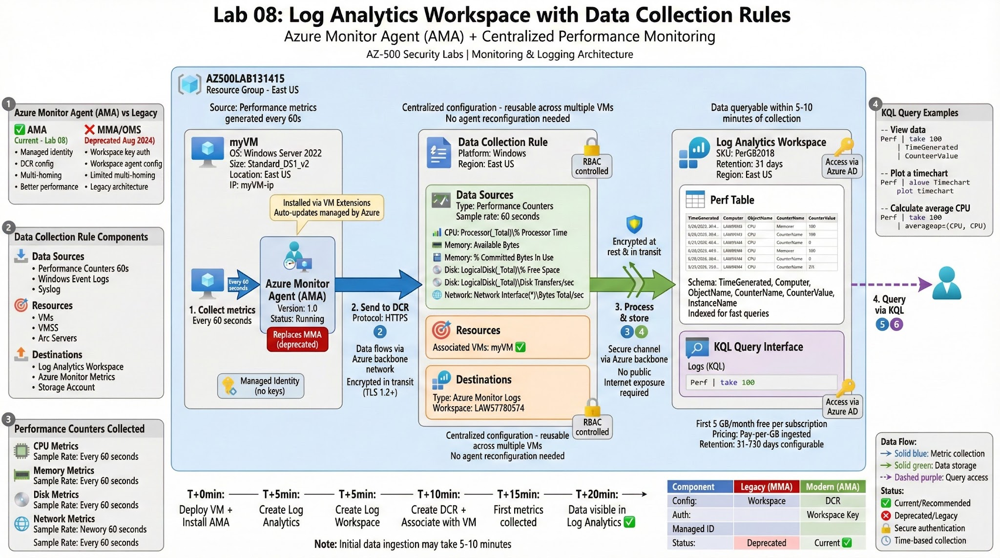

# Lab 08: Log Analytics Workspace + Data Collection Rules (DCR)

## 🎯 Objective

Implement monitoring and log collection from Azure VMs using **Azure Monitor Agent (AMA)** with **Data Collection Rules (DCR)**. Demonstrate centralized logging with Log Analytics Workspace.

## 🏗️ Architecture



**Components:**
- Azure VM: myVM (Windows Server 2022)
- Azure Monitor Agent (AMA): Installed on myVM
- Data Collection Rule (DCR1): Defines what to collect
- Log Analytics Workspace: Centralized log repository

**Data Flow:**
```
myVM → Azure Monitor Agent → DCR1 → Log Analytics Workspace
```

**Metrics Collected:**
- CPU Performance (every 60 seconds)
- Memory Performance (every 60 seconds)
- Disk Performance (every 60 seconds)
- Network Performance (every 60 seconds)

---

## 📋 Lab Tasks

### Task 1: Deploy Azure VM

**Portal Steps:**
```
1. Portal → Virtual machines → + Create

2. Basics:
   - Resource group: Create new "AZ500LAB131415"
   - VM name: myVM
   - Region: East US
   - Image: Windows Server 2022 Datacenter - Gen2
   - Size: Standard_DS1_v2
   - Username: Student
   - Password: Pa55w.rd1234AZ500
   - Public inbound ports: Allow selected ports
   - Select inbound ports: RDP (3389)

3. Disks:
   - OS disk type: Standard SSD

4. Management:
   - Enable auto-shutdown: No

5. Review + create → Create
```

**PowerShell:**
```powershell
# See scripts/01-deploy-vm.ps1

$rgName = "AZ500LAB131415"
$location = "eastus"
$vmName = "myVM"

# Create Resource Group
New-AzResourceGroup -Name $rgName -Location $location

# VM credentials
$vmUser = "Student"
$vmPassword = ConvertTo-SecureString "Pa55w.rd1234AZ500" -AsPlainText -Force
$credential = New-Object System.Management.Automation.PSCredential ($vmUser, $vmPassword)

# Create VM
New-AzVm `
    -ResourceGroupName $rgName `
    -Name $vmName `
    -Location $location `
    -Size "Standard_DS1_v2" `
    -Image "Win2022Datacenter" `
    -Credential $credential `
    -OpenPorts 3389
```

---

### Task 2: Create Log Analytics Workspace

**Portal Steps:**
```
1. Portal → Search "Log Analytics workspaces" → + Create

2. Basics:
   - Resource group: AZ500LAB131415
   - Name: LAW57780574 (or unique name)
   - Region: East US

3. Review + create → Create
```

**PowerShell:**
```powershell
# See scripts/02-create-log-analytics.ps1

$rgName = "AZ500LAB131415"
$workspaceName = "LAW$(Get-Random -Maximum 99999999)"

New-AzOperationalInsightsWorkspace `
    -ResourceGroupName $rgName `
    -Name $workspaceName `
    -Location "eastus" `
    -Sku PerGB2018

Write-Host "Log Analytics Workspace: $workspaceName" -ForegroundColor Green
```

---

### Task 3: Create Data Collection Rule (DCR)

**Portal Steps:**
```
1. Portal → Monitor → Data Collection Rules → + Create

2. Basics:
   - Rule name: DCR1
   - Resource group: AZ500LAB131415
   - Region: East US
   - Platform Type: Windows

3. Resources:
   - + Add resources
   - Select: myVM
   - Click Add

4. Collect and deliver:
   - + Add data source
   
   Data source:
   - Data source type: Performance Counters
   - Basic (sample rate: 60 seconds)
   - Select performance counters:
     ✅ CPU: Processor(_Total)\% Processor Time
     ✅ Memory: Memory\Available Bytes
     ✅ Memory: Memory\% Committed Bytes In Use
     ✅ Disk: LogicalDisk(_Total)\% Free Space
     ✅ Disk: LogicalDisk(_Total)\Disk Transfers/sec
     ✅ Network: Network Interface(*)\Bytes Total/sec
   
   Destination:
   - Destination type: Azure Monitor Logs
   - Subscription: [Your subscription]
   - Account or namespace: LAW57780574

5. Review + create → Create
```

**PowerShell:**
```powershell
# See scripts/03-create-dcr.ps1

# Note: DCR creation via PowerShell is complex
# Recommended to use Portal or ARM template
# ARM template provided in scripts folder

$rgName = "AZ500LAB131415"
$dcrName = "DCR1"
$workspaceName = "LAW57780574"
$vmName = "myVM"

# Get workspace resource ID
$workspace = Get-AzOperationalInsightsWorkspace `
    -ResourceGroupName $rgName `
    -Name $workspaceName

# Get VM resource ID
$vm = Get-AzVM -ResourceGroupName $rgName -Name $vmName

# Deploy DCR ARM template
# See scripts/03-create-dcr-template.json
```

**ARM Template (scripts/03-create-dcr-template.json):**
```json
{
  "$schema": "https://schema.management.azure.com/schemas/2019-04-01/deploymentTemplate.json#",
  "contentVersion": "1.0.0.0",
  "parameters": {
    "workspaceResourceId": {
      "type": "string"
    },
    "dcrName": {
      "type": "string",
      "defaultValue": "DCR1"
    }
  },
  "resources": [
    {
      "type": "Microsoft.Insights/dataCollectionRules",
      "apiVersion": "2021-09-01-preview",
      "name": "[parameters('dcrName')]",
      "location": "eastus",
      "properties": {
        "dataSources": {
          "performanceCounters": [
            {
              "name": "perfCounterDataSource60",
              "streams": ["Microsoft-Perf"],
              "scheduledTransferPeriod": "PT1M",
              "samplingFrequencyInSeconds": 60,
              "counterSpecifiers": [
                "\\Processor(_Total)\\% Processor Time",
                "\\Memory\\Available Bytes",
                "\\Memory\\% Committed Bytes In Use",
                "\\LogicalDisk(_Total)\\% Free Space",
                "\\LogicalDisk(_Total)\\Disk Transfers/sec",
                "\\Network Interface(*)\\Bytes Total/sec"
              ]
            }
          ]
        },
        "destinations": {
          "logAnalytics": [
            {
              "workspaceResourceId": "[parameters('workspaceResourceId')]",
              "name": "lawDestination"
            }
          ]
        },
        "dataFlows": [
          {
            "streams": ["Microsoft-Perf"],
            "destinations": ["lawDestination"]
          }
        ]
      }
    }
  ]
}
```

---

### Task 4: Install Azure Monitor Agent (AMA)

**Portal Steps:**
```
1. Portal → Virtual machines → myVM

2. Settings → Extensions + applications

3. + Add → Search "Azure Monitor Agent"

4. Select "Azure Monitor Agent for Windows"

5. Click Create

6. Wait for installation (~2-3 minutes)

7. Verify: Status should be "Provisioning succeeded"
```

**PowerShell:**
```powershell
# Install Azure Monitor Agent extension
$rgName = "AZ500LAB131415"
$vmName = "myVM"

Set-AzVMExtension `
    -ExtensionName "AzureMonitorWindowsAgent" `
    -ResourceGroupName $rgName `
    -VMName $vmName `
    -Publisher "Microsoft.Azure.Monitor" `
    -ExtensionType "AzureMonitorWindowsAgent" `
    -TypeHandlerVersion "1.0" `
    -Location "eastus"
```

**Note:** Azure Monitor Agent (AMA) replaces deprecated Log Analytics Agent (MMA/OMS).

---

### Task 5: Associate DCR with VM

**Portal Steps:**
```
1. Portal → Monitor → Data Collection Rules → DCR1

2. Configuration → Resources

3. + Add

4. Select: myVM

5. Click Add

6. Wait for association (~1-2 minutes)
```

**PowerShell:**
```powershell
# Associate DCR with VM
$rgName = "AZ500LAB131415"
$vmName = "myVM"
$dcrName = "DCR1"

$vm = Get-AzVM -ResourceGroupName $rgName -Name $vmName
$dcr = Get-AzDataCollectionRule -ResourceGroupName $rgName -Name $dcrName

New-AzDataCollectionRuleAssociation `
    -ResourceUri $vm.Id `
    -DataCollectionRuleId $dcr.Id `
    -AssociationName "dcr-association"
```

---

### Task 6: Query Logs in Log Analytics

**Portal Steps:**
```
1. Portal → Log Analytics workspaces → LAW57780574

2. General → Logs

3. Close welcome screen

4. Run query:
```

**KQL Queries (scripts/04-query-logs.kql):**
```kql
// Query 1: View all performance data
Perf
| take 100

// Query 2: CPU performance over time
Perf
| where ObjectName == "Processor" and CounterName == "% Processor Time"
| where InstanceName == "_Total"
| project TimeGenerated, Computer, CounterValue
| sort by TimeGenerated desc

// Query 3: Memory usage
Perf
| where ObjectName == "Memory"
| where CounterName == "Available Bytes" or CounterName == "% Committed Bytes In Use"
| project TimeGenerated, Computer, CounterName, CounterValue
| sort by TimeGenerated desc

// Query 4: Disk performance
Perf
| where ObjectName == "LogicalDisk"
| where InstanceName == "_Total"
| project TimeGenerated, Computer, CounterName, CounterValue
| sort by TimeGenerated desc

// Query 5: Network performance
Perf
| where ObjectName == "Network Interface"
| project TimeGenerated, Computer, CounterName, CounterValue
| sort by TimeGenerated desc

// Query 6: Average CPU over 5 minutes
Perf
| where ObjectName == "Processor" and CounterName == "% Processor Time"
| where InstanceName == "_Total"
| summarize AvgCPU = avg(CounterValue) by bin(TimeGenerated, 5m)
| render timechart

// Query 7: Count of metrics by object
Perf
| summarize Count = count() by ObjectName
```

**Wait Time:** Data may take **5-10 minutes** to appear after DCR association.

---

## ✅ Validation

**Expected Results:**

1. **Azure Monitor Agent installed** on myVM (Extensions blade shows "Provisioning succeeded")

2. **DCR associated** with myVM (Monitor → DCR1 → Resources shows myVM)

3. **Metrics visible** in Log Analytics:
   - Run query: `Perf | take 100`
   - Should return performance counters
   - TimeGenerated within last few minutes

4. **Performance counters collected:**
   - CPU: Processor Time
   - Memory: Available Bytes, Committed Bytes
   - Disk: Free Space, Transfers/sec
   - Network: Bytes Total/sec

---

## 🔐 Key Concepts

### Azure Monitor Agent (AMA) vs Legacy Agents

| Feature | Azure Monitor Agent (AMA) | Log Analytics Agent (MMA) |
|---|---|---|
| **Status** | ✅ Current | ❌ Deprecated (Aug 2024) |
| **Configuration** | Data Collection Rules (DCR) | Workspace agent configuration |
| **Multi-homing** | ✅ Multiple workspaces | ⚠️ Limited |
| **Security** | ✅ Managed identity | ⚠️ Workspace key |
| **Performance** | ✅ Optimized | ⚠️ Legacy |

**Lab 08 uses AMA (recommended)**

---

### Data Collection Rules (DCR)

**Components:**
- **Data Sources:** What to collect (Performance Counters, Windows Events, Syslog)
- **Resources:** From where (VMs, VMSS, Arc servers)
- **Destinations:** Where to send (Log Analytics, Metrics, Storage)

**Benefits:**
- Centralized configuration
- Reusable across multiple VMs
- No agent reconfiguration needed
- Supports filtering and transformations

---

### Log Analytics Workspace

**Purpose:**
- Centralized repository for logs and metrics
- KQL (Kusto Query Language) for querying
- Integration with Azure Monitor, Sentinel, Defender

**Pricing:**
- Pay-per-GB ingested
- First 5 GB/month free (per subscription)
- Data retention: 31 days default (up to 730 days)

---

## 🛠️ Skills Demonstrated

- Azure VM deployment
- Log Analytics Workspace creation
- Azure Monitor Agent (AMA) installation
- Data Collection Rules (DCR) configuration
- Performance counter collection
- KQL query writing
- Azure Monitor integration

---

## 🎯 MITRE ATT&CK Mapping

### Detection Capabilities:

**T1059 - Command and Scripting Interpreter**
- Detection: Process creation logs (if Windows Event logs added to DCR)

**T1070 - Indicator Removal on Host**
- Detection: File/registry modifications (with appropriate DCR config)

**T1003 - OS Credential Dumping**
- Detection: Security event logs (if collected via DCR)

**General:**
- Performance monitoring establishes baseline for anomaly detection
- Logs provide forensic trail for incident response

---

## 🧹 Cleanup
```powershell
# See scripts/cleanup.ps1
Remove-AzResourceGroup -Name "AZ500LAB131415" -Force -AsJob
```

---

## 📝 Notes

**AMA vs MMA:**
- MMA (Microsoft Monitoring Agent) = Legacy
- OMS Agent = Old name for MMA
- **AMA (Azure Monitor Agent) = Current standard** ✅

**Data Collection Delay:**
- Initial data: 5-10 minutes after DCR association
- Ongoing collection: Every 60 seconds (per DCR config)

**DCR Flexibility:**
- Can target multiple VMs
- Can send to multiple destinations
- Can filter data before ingestion (cost savings)

**Workspace ID vs Resource ID:**
- DCR uses Resource ID (new approach)
- MMA used Workspace ID/Key (legacy)

---

**Lab completed when:**
- VM running ✅
- AMA installed ✅
- DCR created and associated ✅
- Performance data visible in Log Analytics ✅
