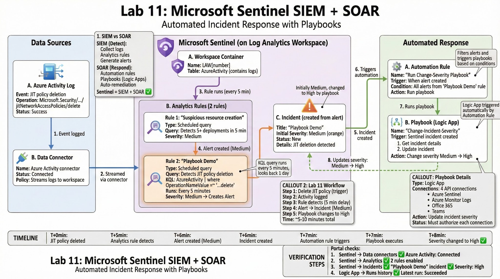

# Lab 11: Microsoft Sentinel (SIEM + SOAR)

## 🎯 Objective

Implement **Microsoft Sentinel** as a cloud-native SIEM (Security Information and Event Management) and SOAR (Security Orchestration, Automation, and Response) solution. Configure data connectors, analytics rules, and automated response playbooks.

## 🏗️ Architecture



**Components:**
- Log Analytics Workspace (from Lab 08 or new)
- Microsoft Sentinel (enabled on workspace)
- Azure Activity Log Connector
- Analytics Rule (detects JIT policy deletion)
- Playbook (Logic App for automated response)
- Automation Rule (triggers playbook on alert)

**Data Flow:**
```
Azure Activity Log → Sentinel Workspace → Analytics Rule → Alert → Incident → Automation Rule → Playbook → Action
```

---

## 📋 Prerequisites

- Log Analytics Workspace (can reuse from Lab 08 or create new)
- Azure subscription with Contributor access
- JIT VM Access configured (Lab 10) for testing

---

## 🔧 Lab Tasks

### Task 1: Create Log Analytics Workspace (if needed)

**Portal Steps:**
```
1. Portal → Search "Log Analytics workspaces" → + Create

2. Basics:
   - Resource group: AZ500LAB131415 (or new)
   - Name: LAW[uniquenumber]
   - Region: East US

3. Review + create → Create

4. Wait for deployment
```

**PowerShell:**
```powershell
# See scripts/01-create-sentinel-workspace.ps1

$rgName = "AZ500LAB131415"
$workspaceName = "LAW$(Get-Random -Maximum 99999999)"

New-AzOperationalInsightsWorkspace `
    -ResourceGroupName $rgName `
    -Name $workspaceName `
    -Location "eastus" `
    -Sku PerGB2018
```

**Note:** If you have workspace from Lab 08, skip this step and use existing workspace.

---

### Task 2: Enable Microsoft Sentinel

**Portal Steps:**
```
1. Portal → Search "Microsoft Sentinel" → Click service

2. Click "+ Create"

3. Select workspace:
   - Choose: LAW[number] (from Task 1 or Lab 08)
   - Click "Add"

4. Wait for deployment (~1 minute)

5. Sentinel Overview page appears
```

**PowerShell:**
```powershell
# Enable Sentinel on workspace
$workspace = Get-AzOperationalInsightsWorkspace `
    -ResourceGroupName $rgName `
    -Name $workspaceName

# Note: Sentinel enablement is done via ARM deployment
# See scripts for ARM template approach
```

**Verification:**
```
Portal → Sentinel → Overview
- Dashboard visible
- "Get started" sections appear
- Data connectors available
```

---

### Task 3: Connect Azure Activity Log Data Connector

**Portal Steps:**
```
1. Sentinel → Configuration → Data connectors

2. Search: "Azure Activity"

3. Select: "Azure Activity"

4. Click "Open connector page"

5. Configuration section:
   - Instructions tab shown
   
6. Click "Launch Azure Policy Assignment wizard"

7. Policy assignment:
   - Scope: Select your subscription
   - Basics tab:
     * Assignment name: Configure Azure Activity logs
     * Description: (auto-filled)
   
   - Parameters tab:
     * Primary Log Analytics workspace: Select your workspace
   
   - Remediation tab:
     * ✅ Check: "Create a remediation task"
     * Managed Identity Location: East US
   
   - Review + create → Create

8. Wait for policy assignment (~2 minutes)

9. Back to Data connector page:
   - Status changes to "Connected"
   - Shows: "1 subscription connected"
```

**What This Does:**
- Creates Azure Policy to stream Activity Logs to Sentinel workspace
- Activity Logs include: Resource creation, deletion, configuration changes
- Remediation task applies policy to existing resources

**Verification:**
```
1. Sentinel → Logs

2. Run query:
   AzureActivity
   | take 10

3. Results appear (may take 5-10 minutes for first data)
```

---

### Task 4: Create Analytics Rule (Suspicious Resource Deployment)

**Portal Steps:**
```
1. Sentinel → Analytics

2. Click "+ Create" → "Scheduled query rule"

3. General tab:
   - Name: Suspicious number of resource creation or deployment
   - Description: Detects unusual resource creation activity
   - Tactics: Initial Access
   - Severity: Medium
   - Status: Enabled
   - Click Next: Set rule logic

4. Set rule logic tab:
   
   Rule query:
   AzureActivity
   | where OperationNameValue =~ "Microsoft.Resources/deployments/write"
   | where ActivityStatusValue =~ "Success"
   | summarize Count = count() by CallerIpAddress, bin(TimeGenerated, 5m)
   | where Count >= 5

   Entity mapping: (Leave default or skip)
   
   Query scheduling:
   - Run query every: 5 minutes
   - Lookup data from last: 1 Day
   
   Alert threshold:
   - Generate alert when number of query results: Is greater than 0
   
   Event grouping:
   - Group all events into a single alert
   
   Click Next: Incident settings

5. Incident settings:
   - ✅ Create incidents from alerts triggered by this analytics rule
   - Alert grouping: Group all alerts into a single incident
   
   Click Next: Automated response

6. Automated response:
   - (Skip for now, configured later)
   
   Click Next: Review and create

7. Review + create → Create

8. Rule appears in Analytics list with status "Enabled"
```

**PowerShell:**
```powershell
# See scripts/03-create-analytics-rule.ps1
# Complex to create via PowerShell, Portal recommended
```

---

### Task 5: Create Playbook (Logic App)

**ARM Template Deployment:**

**Portal Steps:**
```
1. Portal → Deploy a custom template

2. Build your own template in the editor

3. Paste ARM template (see scripts/04-deploy-playbook.json)

4. Save

5. Parameters:
   - Resource group: AZ500LAB131415
   - Playbook Name: Change-Incident-Severity
   - User Name: [Your Azure AD email]
   
6. Review + create → Create

7. Wait for deployment

8. Go to resource: Change-Incident-Severity (Logic App)

9. API Connections setup (4 connections required):
   
   Left menu → API connections (or edit Logic App)
   
   For each connection (azuresentinel, azuremonitorlogs, office365, teams):
   - Click connection name
   - Click "Edit API connection"
   - Click "Authorize"
   - Sign in with Azure AD
   - Save
   
10. All 4 connections show "Connected" status
```

**ARM Template (scripts/04-deploy-playbook.json):**
```json
{
  "$schema": "https://schema.management.azure.com/schemas/2019-04-01/deploymentTemplate.json#",
  "contentVersion": "1.0.0.0",
  "parameters": {
    "PlaybookName": {
      "defaultValue": "Change-Incident-Severity",
      "type": "string"
    },
    "UserName": {
      "type": "string"
    }
  },
  "variables": {
    "AzureSentinelConnectionName": "azuresentinel"
  },
  "resources": [
    {
      "type": "Microsoft.Web/connections",
      "apiVersion": "2016-06-01",
      "name": "[variables('AzureSentinelConnectionName')]",
      "location": "[resourceGroup().location]",
      "properties": {
        "displayName": "[parameters('UserName')]",
        "customParameterValues": {},
        "api": {
          "id": "[concat('/subscriptions/', subscription().subscriptionId, '/providers/Microsoft.Web/locations/', resourceGroup().location, '/managedApis/azuresentinel')]"
        }
      }
    },
    {
      "type": "Microsoft.Logic/workflows",
      "apiVersion": "2017-07-01",
      "name": "[parameters('PlaybookName')]",
      "location": "[resourceGroup().location]",
      "dependsOn": [
        "[resourceId('Microsoft.Web/connections', variables('AzureSentinelConnectionName'))]"
      ],
      "properties": {
        "state": "Enabled",
        "definition": {
          "$schema": "https://schema.management.azure.com/providers/Microsoft.Logic/schemas/2016-06-01/workflowdefinition.json#",
          "contentVersion": "1.0.0.0",
          "parameters": {
            "$connections": {
              "defaultValue": {},
              "type": "Object"
            }
          },
          "triggers": {
            "When_Azure_Sentinel_incident_creation_rule_was_triggered": {
              "type": "ApiConnectionWebhook",
              "inputs": {
                "body": {
                  "callback_url": "@{listCallbackUrl()}"
                },
                "host": {
                  "connection": {
                    "name": "@parameters('$connections')['azuresentinel']['connectionId']"
                  }
                },
                "path": "/incident-creation"
              }
            }
          },
          "actions": {
            "Update_incident": {
              "runAfter": {},
              "type": "ApiConnection",
              "inputs": {
                "body": {
                  "incidentArmId": "@triggerBody()?['object']?['id']",
                  "severity": "High"
                },
                "host": {
                  "connection": {
                    "name": "@parameters('$connections')['azuresentinel']['connectionId']"
                  }
                },
                "method": "put",
                "path": "/Incidents"
              }
            }
          }
        },
        "parameters": {
          "$connections": {
            "value": {
              "azuresentinel": {
                "connectionId": "[resourceId('Microsoft.Web/connections', variables('AzureSentinelConnectionName'))]",
                "connectionName": "[variables('AzureSentinelConnectionName')]",
                "id": "[concat('/subscriptions/', subscription().subscriptionId, '/providers/Microsoft.Web/locations/', resourceGroup().location, '/managedApis/azuresentinel')]"
              }
            }
          }
        }
      }
    }
  ]
}
```

**What This Playbook Does:**
- Trigger: When Sentinel incident is created
- Action: Change incident severity from Medium → High

---

### Task 6: Create Custom Analytics Rule with Playbook

**Portal Steps:**
```
1. Sentinel → Analytics → + Create → Scheduled query rule

2. General:
   - Name: Playbook Demo
   - Tactics: Initial Access
   - Severity: Medium
   - Status: Enabled

3. Set rule logic:
   
   Rule query:
   AzureActivity
   | where OperationNameValue =~ "Microsoft.Security/locations/jitNetworkAccessPolicies/delete"
   | where ActivityStatusValue =~ "Success"
   
   Query scheduling:
   - Run every: 5 minutes
   - Lookup data: 1 Day
   
   Alert threshold: Is greater than 0
   
   Next: Incident settings

4. Incident settings:
   - ✅ Create incidents
   - Alert grouping: Single incident
   
   Next: Automated response

5. Automated response:
   - Add automation rule → + Add new
   
   Automation rule:
   - Name: Run Change-Severity Playbook
   - Trigger: When alert is created
   - Conditions: (None, applies to all)
   - Actions: Run playbook → Change-Incident-Severity
   
   - Click Apply

6. Review + create → Create
```

---

### Task 7: Test the Workflow (Delete JIT Policy)

**Trigger the Alert:**

**Portal Steps:**
```
1. Portal → Virtual machines → myVM (from Lab 10)

2. Configuration → Just-in-time VM access

3. Click "Remove" or "Disable"

4. Confirm deletion

5. JIT policy deleted (Activity logged)
```

**PowerShell:**
```powershell
# See scripts/05-delete-jit-policy.ps1

Remove-AzJitNetworkAccessPolicy `
    -ResourceGroupName "AZ500LAB131415" `
    -Location "eastus" `
    -Name "default"
```

**Wait 5-10 minutes for workflow:**
```
1. Activity Log records deletion
2. Sentinel analytics rule runs (every 5 min)
3. Alert created (Medium severity)
4. Incident created in Sentinel
5. Automation rule triggers
6. Playbook executes
7. Incident severity changed: Medium → High
```

---

### Task 8: Verify Incident and Playbook Execution

**Portal Steps:**
```
1. Sentinel → Incidents

2. Locate incident:
   - Title: "Playbook Demo"
   - Severity: High (changed from Medium by playbook)
   - Status: New

3. Click incident to open details

4. Verify:
   - Alert details show JIT policy deletion
   - Activity timeline shows:
     * Alert created (Medium)
     * Playbook executed
     * Severity changed to High
   
5. Check playbook execution:
   - Logic App → Change-Incident-Severity
   - Overview → Runs history
   - Latest run shows: Succeeded
   - Run details show trigger + update action
```

---

## ✅ Validation

**Expected Results:**

1. **Sentinel Enabled:**
   - Workspace has Sentinel activated
   - Overview dashboard visible

2. **Data Connector Active:**
   - Azure Activity connector: Connected
   - Status: "1 subscription connected"

3. **Analytics Rules Created:**
   - "Suspicious number of resource creation" rule: Enabled
   - "Playbook Demo" rule: Enabled

4. **Playbook Deployed:**
   - Logic App "Change-Incident-Severity": Exists
   - API connections: All authorized (4/4)

5. **Workflow Tested:**
   - JIT policy deleted → Activity logged
   - Alert generated by analytics rule
   - Incident created (initially Medium)
   - Playbook triggered automatically
   - Incident severity changed to High ✅

---

## 🔐 Key Concepts

### SIEM vs SOAR

**SIEM (Security Information and Event Management):**
- Collects logs from multiple sources
- Correlates events
- Generates alerts
- Provides dashboards and reports

**SOAR (Security Orchestration, Automation, and Response):**
- Automates response to alerts
- Orchestrates workflows across tools
- Reduces manual investigation time
- Playbooks for common scenarios

**Microsoft Sentinel = SIEM + SOAR** (unified platform)

---

### Sentinel Components

**1. Data Connectors:**
- Azure services (Activity Log, Defender, etc.)
- Microsoft 365 (Office 365, Teams, etc.)
- Third-party (Syslog, CEF, APIs)
- 200+ built-in connectors

**2. Analytics Rules:**
- Scheduled: KQL query runs on schedule
- Fusion: ML-based multi-stage attack detection
- Microsoft Security: Alerts from Defender, etc.
- Anomaly: Behavioral analytics

**3. Incidents:**
- Grouping of related alerts
- Investigation workspace
- Collaboration features (comments, assignments)

**4. Playbooks:**
- Logic Apps triggered by incidents
- Automated response actions
- Integration with 400+ connectors

**5. Automation Rules:**
- Trigger playbooks automatically
- Apply tags, change severity, assign owner
- Condition-based execution

---

### KQL Query Explained

**Analytics Rule Query:**
```kql
AzureActivity
| where OperationNameValue =~ "Microsoft.Security/locations/jitNetworkAccessPolicies/delete"
| where ActivityStatusValue =~ "Success"
```

**Breakdown:**
- `AzureActivity`: Table with Azure Activity Logs
- `OperationNameValue`: Type of operation performed
- `=~`: Case-insensitive comparison
- `Microsoft.Security/...delete`: JIT policy deletion operation
- `ActivityStatusValue`: Result of operation
- `Success`: Only successful deletions (not failures)

**Result:** Detects when someone deletes a JIT policy

---

### Playbook Logic

**Workflow:**
```
1. Trigger: Sentinel incident created
2. Get incident details (ID, severity, etc.)
3. Action: Update incident
   - Incident ARM ID: (from trigger)
   - New severity: High
4. Result: Incident severity changed
```

**Use Cases:**
- Change severity based on conditions
- Send email/Teams notification
- Block IP in firewall
- Isolate compromised VM
- Create ServiceNow ticket

---

## 🛠️ Skills Demonstrated

- Microsoft Sentinel deployment
- Log Analytics Workspace integration
- Azure Policy for data collection
- Data connector configuration
- KQL query writing for analytics rules
- Logic App (playbook) creation via ARM
- API connection authorization
- Automation rule configuration
- Incident investigation
- SIEM + SOAR workflow

---

## 🎯 MITRE ATT&CK Mapping

### Detection Scenarios:

**T1098 - Account Manipulation**
- Detection: Analytics rule for privilege changes
- Data source: Azure Activity Log

**T1562 - Impair Defenses**
- Detection: JIT policy deletion (Lab 11 demo)
- Data source: Azure Activity Log
- Response: Playbook escalates severity

**T1078 - Valid Accounts (Abuse)**
- Detection: Unusual login patterns
- Data source: Azure AD Sign-ins (if connected)

**General:**
- Sentinel maps alerts to MITRE tactics automatically
- Incidents show related MITRE techniques
- Fusion detection identifies multi-stage attacks

---

## 🧹 Cleanup

**Portal:**
```
1. Portal → Resource groups → AZ500LAB131415

2. Delete resources individually or entire RG:
   - Sentinel workspace (removes Sentinel data)
   - Logic App (playbook)
   - API connections
   - Log Analytics Workspace (if not needed)

3. Or delete entire resource group:
   - Resource groups → AZ500LAB131415 → Delete
```

**PowerShell:**
```powershell
# See scripts/cleanup.ps1

Remove-AzResourceGroup -Name "AZ500LAB131415" -Force -AsJob
```

---

## 📝 Notes

### Important Points:

**Pricing:**
- Sentinel: Pay-per-GB ingested (~$2.30/GB)
- First 10 GB/day free (90-day retention)
- Activity Logs: Low volume (~50-100 MB/day)
- Lab cost: Minimal (< $1 for demo)

**Data Retention:**
- Default: 90 days in Sentinel
- Can extend up to 2 years (additional cost)
- Archived data available for long-term queries

**Playbook Permissions:**
- Logic App needs Sentinel Contributor role
- Granted via Managed Identity or service principal
- API connections require user authorization

**Analytics Rule Delay:**
- Rules run on schedule (5 min default)
- Alert generation not instant (1-2 min processing)
- Total delay: 5-10 minutes from event to incident

**Integration with Lab 10:**
- JIT policy deletion triggers alert (demo scenario)
- Real-world: Monitor critical security config changes
- Playbook auto-escalates severity for quick response

---

**Lab completed when:**
- Sentinel enabled on workspace ✅
- Azure Activity connector configured ✅
- Analytics rule created and enabled ✅
- Playbook deployed and authorized ✅
- Automation rule configured ✅
- JIT deletion detected → Incident created ✅
- Playbook executed → Severity changed ✅
